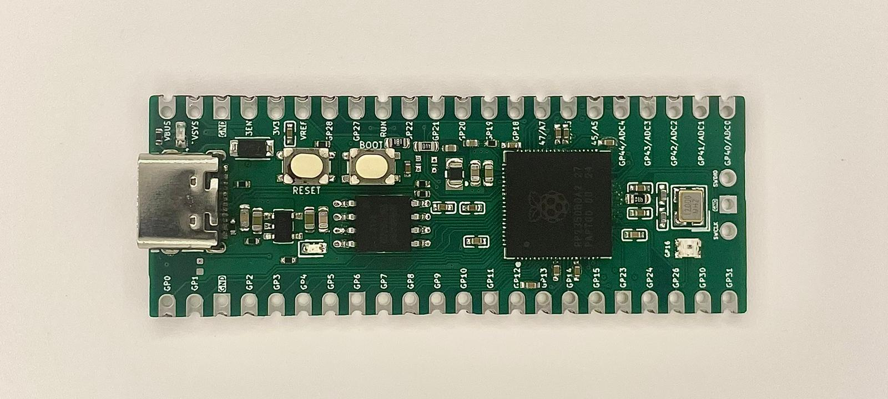

# RP2350B Pico Board

This is a custom RP2350B development board designed to match the **Raspberry Pi Pico** form factor.  
It keeps a similar form factor but is extended by a few pins, in order to break out all 8 analog gpio.

---

## Features
- **RP2350B microcontroller**
- **Pico-compatible pinout**
- **USB-C connector**
- **WS2812 RGB LED** on **GPIO16**
- **BOOT** and **RESET** buttons
- **Castellated edges** for module or breadboard use

---

## Notes
- The WS2812 LED on **GPIO16** can be controlled using any standard NeoPixel or WS2812 library.
- The board powers from **USB 5V (VBUS)** through a Schottky diode to **VSYS**,  
  then regulated down to **3.3V** for the MCU.
- Fully compatible with the **Raspberry Pi Pico SDK**, **MicroPython**, and **CircuitPython**.

---

Designed for experimentation and easy migration from RP2040 to RP2350 as I wanted more analog pins for a project.
Inspiration taken from  [pico-stretch](https://github.com/jvanderberg/pico-stretch) by [jvanderberg](https://github.com/jvanderberg)
